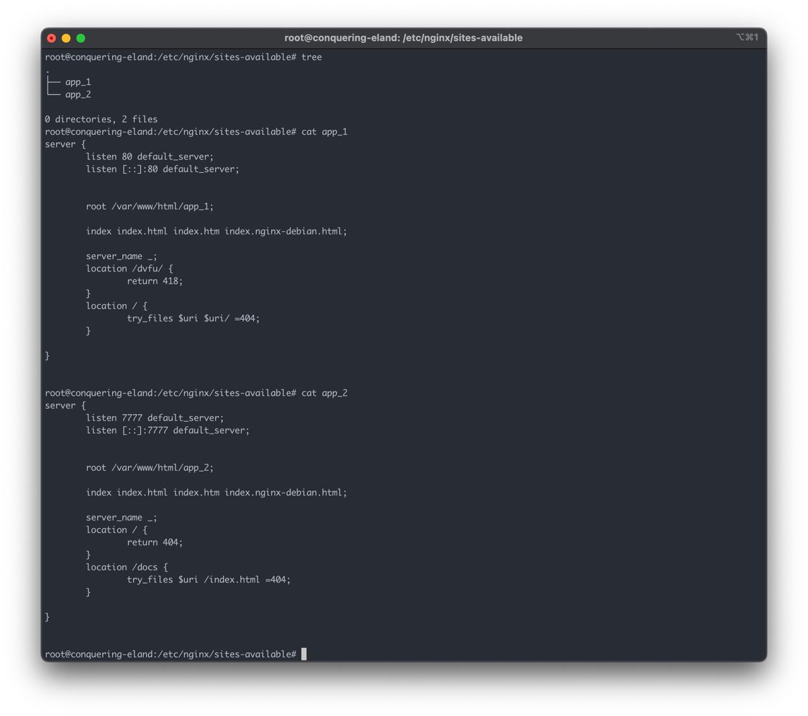
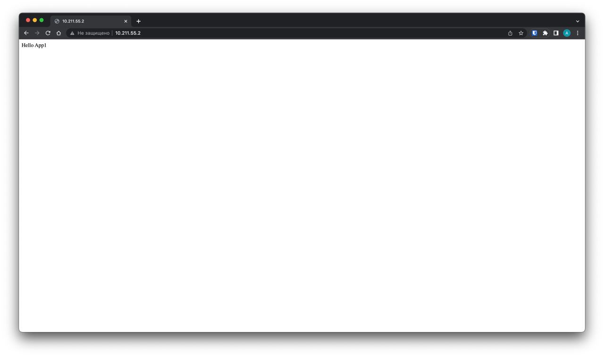

## Задание
Реализовать два приложения, располагающиеся на файловой системе в */var/www/html/app1/index.html* и  */var/www/html/app2/index.html*, доступные по адресам http://ip/ и http://ip:7777/docs/ соответственно с помощью конфигурирования NGINX.

## Результат

---

---
